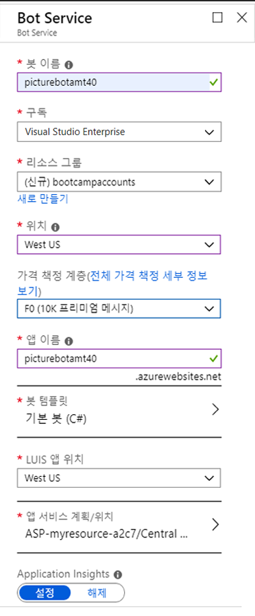
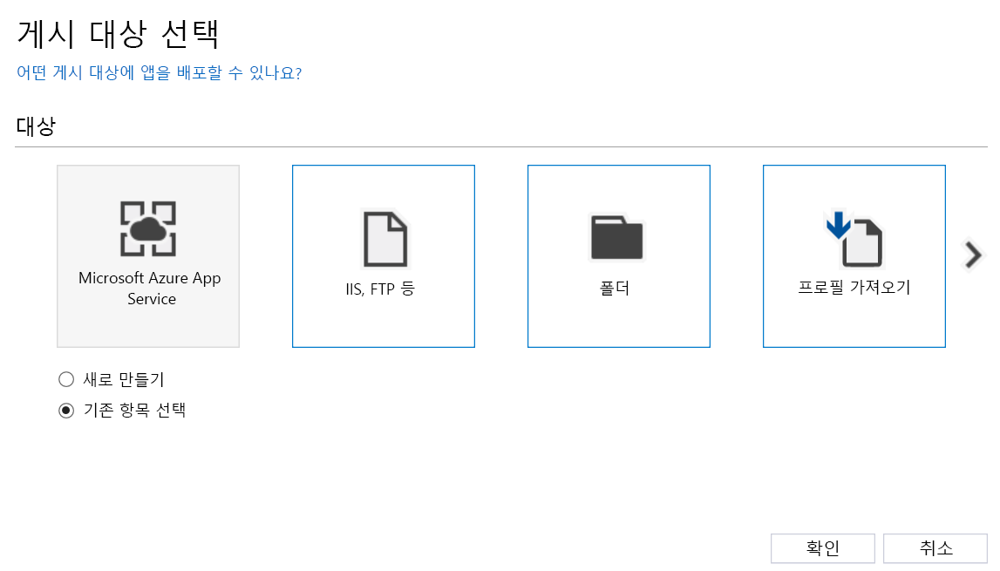
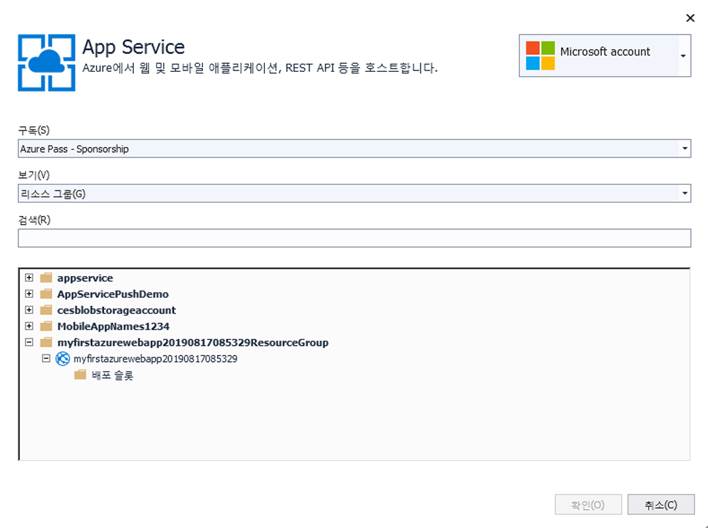
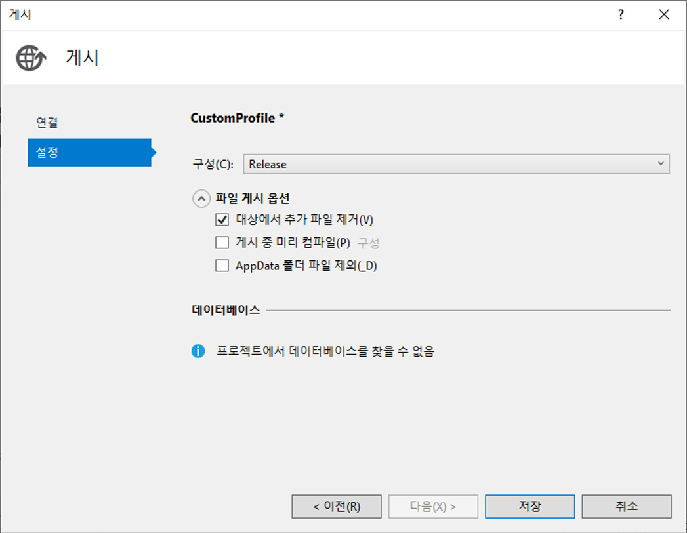

## 4_Publish_and_Register:
예상 시간: 10-15분

### 랩 4.1: 봇 게시

Microsoft Bot Framework를 사용하여 만든 봇은 공개적으로 액세스할 수 있는 모든 URL에서 호스트할 수 있습니다.  이 랩에서는 [Azure Bot Service](https://docs.microsoft.com/ko-kr/bot-framework/bot-service-overview-introduction)를 사용하여 봇을 등록합니다.

포털로 이동합니다. 포털에서 "리소스 만들기"를 클릭하고 "봇"을 검색합니다. 웹앱 봇을 선택하고 만들기를 클릭합니다. 이름에는 고유 식별자를 만들어야 합니다. PictureBot[i][n]과 비슷한 식별자를 사용하는 것이 좋습니다. 여기서 [i]는 사용자의 이니셜이고 [n]은 번호입니다(예: 제 경우는 PictureBotamt40). 가장 가까운 지역을 입력합니다.
가격 책정 계층에는 F0을 선택합니다. 이 워크샵에서는 이 값만 필요합니다. 봇 템플릿을 기본(C#)으로 설정하고 새 App Service 계획을 구성합니다(봇과 동일한 위치에 배치). PictureBot으로 덮어쓸 것이므로 선택하는 템플릿은 중요하지 않습니다. 비용을 절감하기 위해 Application Insights를 끕니다. 만들기를 클릭합니다.

 

방금 매우 단순한 EchoBot(앞에서 시작하는 데 사용된 템플릿과 유사)을 게시했습니다. 다음으로 이 봇 서비스에 PictureBot을 게시해야 합니다.

먼저 몇 가지 키를 가져와야 합니다. 방금 만든 웹앱 봇(포털에 있음)으로 이동합니다. App Service 설정->응용 프로그램 설정->앱 설정에서 BotId, MicrosoftAppId 및 MicrosoftAppPassword를 가져옵니다. 잠시 후에 이러한 키가 필요합니다.

Visual Studio에서 PictureBot으로 돌아갑니다. Web.config 파일에서 BotId, MicrosoftAppId 및 MicrosoftAppPassword로 'appSettings' 아래 공란을 채웁니다. 파일을 저장합니다. 

> 오류가 발생하여 MicrosoftAppPassword를 입력하라는 메시지가 표시됩니까? XML이므로 키에 "&", "<", ">", "'" 또는 '"'가 포함된 경우 이러한 기호를 다음과 같은 [이스케이프 기능](https://en.wikipedia.org/wiki/XML#Characters_and_escaping)으로 바꿔야 합니다. "\&amp;", "\&lt;", "\&gt;", "\&apos;", "\&quot;". 

솔루션 탐색기에서 봇 응용 프로그램 프로젝트를 마우스 오른쪽 단추로 클릭하고 "게시"를 선택합니다.  이렇게 하면 Azure에 봇을 게시하는 과정을 안내하는 마법사가 시작됩니다.  

게시 대상을 "Microsoft Azure App Service"로 선택하고 "기존 항목 선택"을 선택합니다.  

 

App Service 화면에서 적절한 구독, 리소스 그룹 및 봇 서비스를 선택합니다. 게시를 선택합니다.

 

> 여기서 오류가 발생하면 Visual Studio 내의 브라우저 창을 종료하고 다음 단계를 완료하면 됩니다.

이제 웹 배포 설정이 표시되지만 마지막으로 편집해야 합니다. 게시 프로필에서 "설정"을 선택합니다. 설정을 다시 선택하고 "대상에서 추가 파일 제거" 옆의 확인란을 선택합니다. "저장"을 클릭하여 창을 종료한 다음 "게시"를 클릭합니다.  Visual Studio의 출력 창에 배포 프로세스가 표시되고  http://picturebotamt6.azurewebsites.net/ 같은 URL에 봇이 호스팅됩니다. 여기서 "picturebotamt6"는 Bot Service 앱 이름입니다.  

 

### 포털에서 봇 관리

포털의 웹앱 봇 리소스로 돌아갑니다. 봇 관리에서 "웹 채팅에서 테스트"를 선택하여 봇이 게시되고 적절히 작동하는지 테스트합니다. 적절히 작동하지 않는 경우 단계를 건너뛰었을 수 있으므로 이전 랩을 검토합니다. 다시 게시하고 여기로 돌아옵니다.

봇이 게시되고 작동하는지 확인한 후 봇 관리에서 다른 기능 중 일부를 확인하십시오. "채널"을 선택합니다. 많은 채널이 있으며, 특정 채널을 선택하면 구성하는 방법에 대한 안내가 표시됩니다. 

봇과 관련된 다양한 측면에 대해 자세히 알아보고 싶으신가요? [방법 및 디자인 원칙](https://docs.microsoft.com/ko-kr/bot-framework/bot-service-design-principles)을 읽어 보십시오.

### [5_Challenge_and_Closing](./5_Challenge_and_Closing.md)로 계속 진행  
[README](./0_README.md)로 돌아가기
