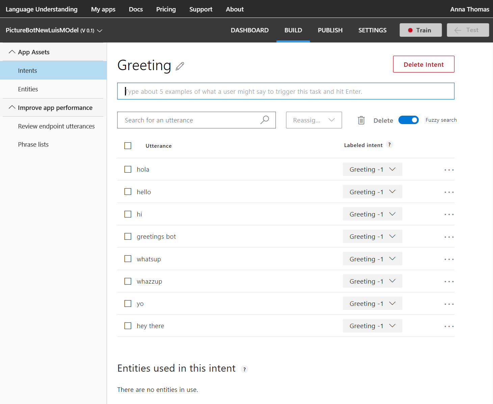
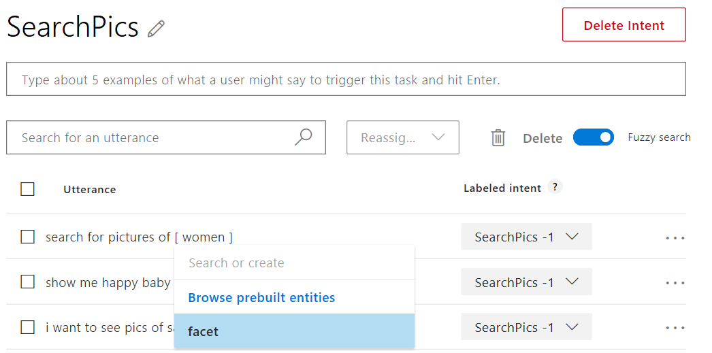
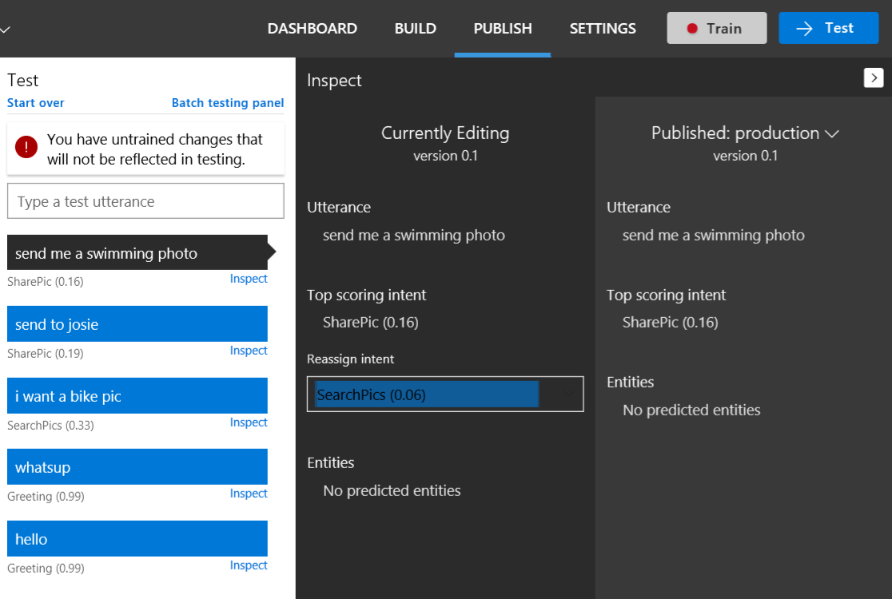

---
lab:
    title: '랩 6: LUIS 모델 구현'
    module: '모듈 4: LUIS로 Language Understanding 기능을 만드는 방법 알아보기'
---

# 랩 6: LUIS 모델 구현

이 실습 랩에서는 Microsoft의 LUIS(Language Understanding Intelligent Service)를 사용하여 응용 프로그램의 자연어 처리 기능을 향상시키는 모델을 만드는 방법을 안내합니다.

##  소개

이 랩에서는 봇(이후 랩에서 만듦)이 사용자와 효과적으로 커뮤니케이션할 수 있도록 LUIS 모델을 빌드하고 학습시키며 게시합니다.

> **참고** 이 랩에서는 이후 랩에서 보다 지능적인 봇을 빌드하는 데 사용할 LUIS 모델만 만듭니다.

LUIS 기능은 이미 워크샵에서 다루었습니다. LUIS에 대한 내용을 상기하려면 [여기](https://docs.microsoft.com/ko-kr/azure/cognitive-services/LUIS/Home)를 참조하십시오.

이제 LUIS가 무엇인지 알았으므로 LUIS 앱을 계획할 수 있습니다. 이미 특정 텍스트를 포함하는 메시지에 응답하는 기본 봇("PictureBot")을 만들었습니다. 봇이 수행할 수 있는 다양한 작업을 트리거하는 의도를 만들고, 다른 작업이 필요한 엔터티를 만들어야 합니다. 일례로 PictureBot의 의도는 "OrderPic"일 수 있으며 이는 적절한 응답을 제공하기 위해 봇을 트리거합니다.

예를 들어, Search(여기서는 구현되지 않음)의 경우 PictureBot의 의도는 "SearchPics"일 수 있으며, 이는 Azure Search 서비스를 트리거하여 사진을 검색하는 것이므로 검색할 내용을 파악하는 "패싯" 엔터티가 필요합니다. [여기](https://docs.microsoft.com/ko-kr/azure/cognitive-services/LUIS/plan-your-app) 에서 앱을 계획하기 위한 더 많은 예제를 볼 수 있습니다.

앱을 계획했으면 [앱을 빌드하고 학습](https://docs.microsoft.com/ko-kr/azure/cognitive-services/LUIS/luis-get-started-create-app) 시킬 수 있습니다.

다시 한 번 살펴보면, LUIS 응용 프로그램을 만들 때 일반적으로 수행해야 하는 단계는 다음과 같습니다.

  1. [의도 추가](https://docs.microsoft.com/ko-kr/azure/cognitive-services/LUIS/add-intents)
  2. [발화 추가](https://docs.microsoft.com/ko-kr/azure/cognitive-services/LUIS/add-example-utterances)
  3. [엔터티 추가](https://docs.microsoft.com/ko-kr/azure/cognitive-services/LUIS/add-entities)
  4. [구문 목록](https://docs.microsoft.com/ko-kr/azure/cognitive-services/LUIS/add-features) 및 [패턴을 사용하여 성능 향상](https://docs.microsoft.com/ko-kr/azure/cognitive-services/LUIS/luis-how-to-model-intent-pattern)
  5. [학습 및 테스트](https://docs.microsoft.com/ko-kr/azure/cognitive-services/LUIS/train-test)
  6. [끝점 발화 검토](https://docs.microsoft.com/ko-kr/azure/cognitive-services/LUIS/label-suggested-utterances)
  7. [게시](https://docs.microsoft.com/ko-kr/azure/cognitive-services/LUIS/publishapp)

## 랩 6.0: 포털에서 LUIS 서비스 만들기(선택 사항)

LUIS는 랩에 사용할 수 있는 "시작 키"를 제공하므로 포털에서 LUIS 서비스를 만드는 것은 선택 사항입니다. 그러나 포털에서 무료 또는 유료 서비스를 만드는 방법을 확인하려는 경우 아래 단계를 따를 수 있습니다.  

> **참고** 사전 요구 사항인 ARM 템플릿을 실행한 경우, Language Understanding API가 포함된 Cognitive Services 리소스가 이미 있습니다.

1.  [Azure Portal](https://portal.azure.com)을 엽니다.

1.  **리소스 만들기** 를 클릭합니다.

1.  검색 상자에 **Language Understanding** 을 입력하고 **Language Understanding** 을 선택합니다.

1.  **만들기** 를 클릭합니다.

1.  이름에 **{YOURINIT}luisbot** 을 입력합니다.

1.  리소스 그룹과 유사한 구독 및 위치를 선택합니다.

1.  가격 책정 계층의 경우 **F0** 을 선택합니다.

1.  리소스 그룹을 선택합니다.

1.  **만들기** 를 클릭합니다.

**참고** Luis AI 웹 사이트는 Azure 기반 Cognitive Services 리소스를 제어하거나 게시할 수 없습니다.  이러한 리소스를 학습하고 게시하려면 API를 호출해야 합니다.

## 랩 6.1: LUIS를 사용하여 응용 프로그램에 인텔리전스 추가

LUIS를 사용하여 자연어 기능을 추가하는 방법을 살펴보겠습니다. LUIS를 사용하면 자연어 발화(사용자가 봇과 이야기할 때 말할 수 있는 단어/구/문장)를 의도(사용자가 수행하려는 작업)에 매핑할 수 있습니다. 우리의 응용 프로그램에는 몇 가지 의도가 있을 수 있습니다. 사진 찾기, 사진 공유, 사진 인쇄물 주문 등을 예로 들 수 있습니다. 이러한 각 항목을 요청하는 방안으로 몇 가지 예제 발화를 제공할 수 있으며, LUIS는 학습한 내용을 바탕으로 각 의도에 새 추가 발화를 매핑합니다.

> **경고**: Azure 서비스는 IE를 기본 브라우저로 사용하지만 LUIS에는 사용하지 않는 것이 좋습니다. 모든 랩에서 Chrome 또는 Firefox를 사용할 수 있을 것입니다. 아니면 [Microsoft Edge](https://www.microsoft.com/ko-kr/download/details.aspx?id=48126) 또는 [Google Chrome](https://www.google.com/intl/en/chrome/) 을 다운로드할 수 있습니다.

1.  [https://www.luis.ai](https://www.luis.ai)로 이동합니다(**유럽 또는 오스트레일리아에 거주하지 않는 경우***). 봇을 지원하는 새로운 LUIS 앱을 만들 것입니다.

> **참고** **유럽** 지역에서 키를 만든 경우 [https://eu.luis.ai/](https://eu.luis.ai/) 에서 애플리케이션을 만들어야 합니다. **오스트레일리아** 지역에서 키를 만든 경우 [https://au.luis.ai/](https://au.luis.ai/)에서 애플리케이션을 만들어야 합니다. LUIS 게시 지역에 대한 자세한 내용은 [여기](https://docs.microsoft.com/ko-kr/azure/cognitive-services/luis/luis-reference-regions) 에서 확인할 수 있습니다.

1.  Microsoft 계정으로 로그인합니다. 이전 섹션에서 LUIS 키를 만드는 데 사용한 계정과 동일해야 합니다. 

1.  **지금 LUIS 앱 만들기** 를 클릭합니다. LUIS 애플리케이션 목록으로 리디렉션됩니다.  메시지가 표시되면 **레이어 마이그레이션** 을 클릭합니다.  

1.  이번이 처음인 경우, 서비스 이용 약관에 동의하고 국가를 선택하라는 요청을 받게 됩니다. 

- 다음 단계에서 권장 옵션을 선택하고 Azure 계정을 LUIS와 연결해야 합니다. 
- 마지막으로 설정을 확인하면 LUIS 앱 페이지로 이동하게 됩니다.

> **참고**: [현재 페이지](https://www.luis.ai/applications)의 "새 앱" 단추 옆에 "앱 가져오기"도 있습니다.  LUIS 응용 프로그램을 만든 후 전체 앱을 JSON으로 내보내고 소스 제어에 체크 인할 수 있습니다.  이는 코드의 버전을 관리할 때 LUIS 모델의 버전을 관리할 수 있도록 권장되는 모범 사례입니다.  내보낸 LUIS 앱은 "앱 가져오기" 단추를 사용하여 다시 가져올 수 있습니다.  랩 중에 뒤처져서 쉬운 방법을 사용하려면 "앱 가져오기" 단추를 클릭하여 [LUIS 모델](./code/LUIS/PictureBotLuisModel.json)을 가져올 수 있습니다.

1.  기본 페이지에서 **새 앱 만들기** 단추를 클릭합니다.

1.  이름을 입력하고 **완료** 를 클릭합니다.  "효과적인 LUIS 앱을 만드는 방법" 대화 상자를 닫습니다.

1.  상단 탐색 영역에서 **BUILD** 링크를 선택합니다.  "None"이라는 의도가 있습니다.  의도에 매핑되지 않는 임의의 발화는 "None"에 매핑될 수 있습니다.

봇이 다음과 같은 작업을 수행할 수 있도록 하려고 합니다.

+ 사진 검색/찾기
+ 소셜 미디어에 사진 공유
+ 사진 인쇄물 주문
+ 사용자에게 인사(나중에 볼 수 있듯이 다른 방법으로도 가능)

이러한 각 작업을 요청하는 사용자의 의도를 만들어 보겠습니다.  

1.  **새 의도 만들기** 단추를 클릭합니다.

1.  첫 번째 의도의 이름을 **Greeting** 으로 지정하고 **완료** 를 클릭합니다.  

1.  사용자가 봇과 인사할 때 말할 수 있는 몇 가지 예를 제시하고 매번 "Enter" 키를 누릅니다.

엔터티를 만드는 방법을 살펴보겠습니다.  사용자가 사진을 검색하도록 요청하는 경우 원하는 내용을 지정할 수 있습니다.  엔터티에 이를 캡처해 보겠습니다.

1.  왼쪽 열에서 **엔터티** 를 클릭한 다음 **새 엔터티 만들기** 를 클릭합니다.  

1.  엔터티에 **facet** 이라는 이름을 지정합니다.

1.  엔터티 유형의 경우 ["단순"](https://docs.microsoft.com/ko-kr/azure/cognitive-services/LUIS/luis-concept-entity-types)을 선택합니다.  

1.  **완료** 를 클릭합니다.

1.  왼쪽 사이드바에서 **의도** 를 클릭한 다음 **새 의도 만들기** 단추를 클릭합니다.  

1.  **SearchPics** 의 의도 이름을 지정한 다음 **완료** 를 클릭합니다.

인사말과 마찬가지로 일부 샘플 발화(사용자가 봇과 이야기할 때 말할 수 있는 단어/구/문장)를 추가해 보겠습니다.  사람들은 여러 가지 방식으로 사진을 검색할 수 있습니다.  아래의 발화들을 자유롭게 사용하고 봇에게 사진을 검색하도록 요청하는 문구를 자체적으로 더 추가해 보십시오.

+ 야외 사진을 찾아 주세요.
+ 기차 사진이 있나요?
+ 음식 사진을 찾아 주세요.
+ 노는 아이들의 사진을 검색해 주세요.
+ 해변 사진을 보여 주세요.
+ 개 사진을 찾아 주세요.
+ 안경을 쓴 남자의 사진을 보여 주세요.
+ 행복한 아기 사진을 보여 주세요.

몇 가지 발화를 확보했으면 LUIS에게 "패싯" 엔터티로 **검색 항목** 을 선택하는 방법을 가르쳐야 합니다. "패싯" 엔터티가 선택하는 것이 검색됩니다. 

1.  단어를 마우스로 가리키고 클릭한 다음(또는 연속된 단어를 클릭하여 단어 그룹을 선택) "패싯" 엔터티를 선택합니다.

패싯 레이블이 지정되면 발화가 이와 같이 될 수 있습니다.

>**참고** 이 워크샵에는 Azure Search가 포함되지 않지만 이 기능은 데모를 위해 남겨 두었습니다.

1.  왼쪽 사이드바에서 **의도** 를 클릭하고 다음 두 가지 의도를 추가합니다.

+ 한 의도의 이름을 **"SharePic"** 으로 지정합니다.  이는 다음과 같은 발화로 식별될 수 있습니다.

+ 이 사진을 공유해 주세요.
+ 그것을 트윗할 수 있나요?
+ 트위터에 게시해 주세요.

+ **"OrderPic"** 이라는 다른 의도를 만듭니다.  이는 다음과 같은 발화로 전달될 수 있습니다.

+ 이 사진을 인쇄해 주세요.
+ 인쇄물을 주문하고 싶어요.
+ 그것을 8x10 크기로 얻을 수 있나요?
+ 지갑을 주문해 주세요.

발화를 선택할 때 질문, 지시, "~하고 싶어요..." 형식을 조합하여 사용하는 것이 유용할 수 있습니다.

1.  마지막으로 일부 샘플 발화를 "None" 의도에 추가합니다. 이렇게 하면 기능이 애플리케이션의 범위를 벗어날 경우 LUIS 레이블을 지정할 수 있습니다. "피자가 먹고 싶어요", "비디오를 검색해 주세요" 등을 추가해 보십시오. None 의도 내에 앱 발화의 약 10~15%가 있어야 합니다.

## 랩 6.2: LUIS 모델 학습

이제 모델을 학습시킬 수 있습니다.

1.  오른쪽 상단 표시줄에서 **학습** 을 클릭합니다.  제공한 학습 데이터와 함께 발화--> 의도 매핑을 수행하는 모델이 빌드됩니다. 학습이 항상 즉각적으로 이루어지는 것은 아닙니다. 경우에 따라 큐에서 대기하고 몇 분 정도 걸릴 수 있습니다.

1.  상단 표시줄에서 **관리** 를 클릭합니다. 창 왼쪽에 몇 가지 옵션(애플리케이션 정보, 키 및 엔드포인트, 게시 설정, 버전, 공동 작업자)이 있습니다. 다양한 게시 옵션에 대한 자세한 내용은 [여기](https://docs.microsoft.com/ko-kr/azure/cognitive-services/LUIS/PublishApp)에서 확인할 수 있습니다.

1.  **Azure 리소스** 를 선택합니다. 나중에 LUIS 통합을 위해 여기에서 키를 사용하거나 Azure Portal의 키를 사용할 수 있습니다.

1.  상단 표시줄에서 **게시** 를 클릭합니다. "프로덕션" 또는 "스테이징" 엔드포인트에 게시할 수 있는 옵션이 있습니다. 

1.  **프로덕션** 을 선택하고 [두 엔드포인트를 사용하는 이유](https://docs.microsoft.com/ko-kr/azure/cognitive-services/luis/luis-concept-version) 를 읽어보십시오. 

1.  마지막으로 **게시** 를 클릭합니다.

게시하면 LUIS 모델을 호출하는 끝점이 만들어지고  URL이 표시되며, 관련 내용은 이후 랩에서 설명합니다. 

1.  **애플리케이션 정보** 를 클릭하고 **애플리케이션 ID** 를 복사합니다.

1.  **Azure 리소스** 를 클릭하고 키 및 엔드포인트 URL을 복사합니다.

**참고** 전체 URL을 사용하지는 않으며, 단지 **https://{region}.api.cognitive.microsoft.com** 부분만 필요합니다.

1.  오른쪽 상단 표시줄에서 **테스트** 를 클릭합니다. 몇 가지 발화를 입력하고 반환된 의도를 확인합니다. 현재 또는 향후 랩에서 이 작업을 수행할 수 있으므로 [대화형 테스트](https://docs.microsoft.com/ko-kr/azure/cognitive-services/LUIS/Train-Test#interactive-testing) 및 [끝점 발화 검토](https://docs.microsoft.com/ko-kr/azure/cognitive-services/LUIS/luis-how-to-review-endoint-utt) 를 익히십시오.

한 가지 간단한 예가 아래에 나와 있습니다. 모델이 SearchPics이어야 하는데 SharePic으로 "수영 사진을 보내 주세요"를 잘못 할당한 것을 파악하고 의도를 다시 할당했습니다.

이제 학습 단추를 선택하여 앱을 다시 학습시켜야 합니다. 그런 다음 동일한 발화를 테스트하고 최근에 학습한 모델과 이전에 게시된 모델 간의 결과를 비교했습니다. 모델을 사용하는 응용 프로그램에서 업데이트를 확인하려면 모델을 다시 게시해야 합니다.

[브라우저에서 게시된 끝점을 테스트](https://docs.microsoft.com/ko-kr/azure/cognitive-services/LUIS/PublishApp#test-your-published-endpoint-in-a-browser)할 수도 있습니다. 끝점 URL을 복사합니다. 브라우저에서 이 URL을 열려면 URL 매개 변수 `&q=` 를 테스트 쿼리로 설정합니다. 예를 들어 URL에 `Find pictures of dogs` 를 추가한 다음 Enter 키를 누릅니다. HTTP 끝점의 JSON 응답이 브라우저에 표시됩니다.

## 다음 단계

여전히 시간이 남는다면 www.luis.ai 사이트를 탐색해 보십시오. "미리 빌드된 도메인"을 선택하고 [이미 사용 가능한 도메인](https://docs.microsoft.com/ko-kr/azure/cognitive-services/luis/luis-reference-prebuilt-domains)을 확인합니다. 또한 [다른 기능](https://docs.microsoft.com/ko-kr/azure/cognitive-services/luis/luis-concept-feature) 및 [패턴](https://docs.microsoft.com/ko-kr/azure/cognitive-services/luis/luis-concept-patterns) 중 일부를 검토할 수도 있습니다.
그리고 LUIS 모델 생성, LUIS 모델 관리, 대화 시뮬레이션 등을 위한 [BotBuilder-tools](https://github.com/Microsoft/botbuilder-tools) 를 확인하십시오. 나중에 [LUIS 스키마를 디자인하는 방법이 포함된 다른 과정](https://aka.ms/daaia) 에도 관심을 갖게 될 수 있습니다.

##  추가 크레딧

Azure Search를 포함한 LUIS 모델을 만들려면 [검색을 포함한 LUIS 모델](https://github.com/Azure/LearnAI-Bootcamp/tree/master/lab01.5-luis)에 대한 학습을 따릅니다.

## 다음 단계

-   [랩 07-01: LUIS 통합](../Lab7-Integrate_LUIS/01-Introduction.md)
